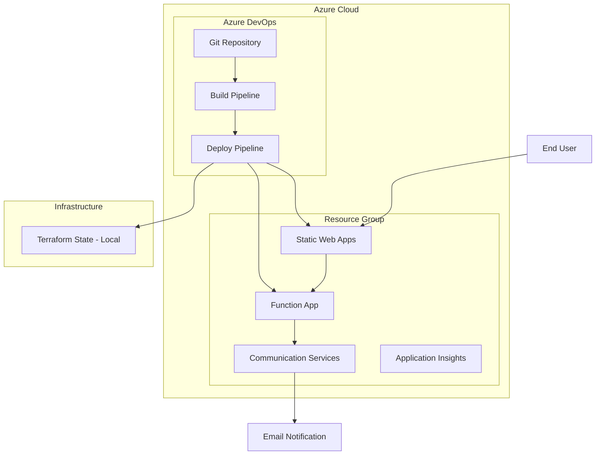

# Design Document

## Overview

This design outlines the architecture for deploying a React-based dating planner app to Azure with automated CI/CD and email notifications. The solution leverages Azure's free tier services to minimize costs while providing reliable hosting and notification capabilities.

## Architecture

### High-Level Architecture



### Service Selection Rationale

1. **Azure Static Web Apps (Free Tier)**: Perfect for React apps, includes CDN, SSL, and custom domains
2. **Azure Functions (Consumption Plan)**: Serverless backend for email notifications, pay-per-execution
3. **Azure Communication Services**: Cost-effective email service with generous free tier
4. **Application Insights (Free Tier)**: Basic monitoring and logging
5. **Azure DevOps (Free for up to 5 users)**: CI/CD pipelines with YAML configuration

## Components and Interfaces

### Frontend Application
- **Technology**: React 19 + Vite + TypeScript
- **Hosting**: Azure Static Web Apps
- **Build Output**: Static files (HTML, CSS, JS)
- **API Integration**: HTTP calls to Azure Functions

### Backend API
- **Technology**: Azure Functions (Node.js/TypeScript) - Code-based deployment
- **Runtime**: Node.js 18+ on Linux Consumption Plan
- **Trigger**: HTTP trigger for form submissions
- **Deployment**: Code deployment (not containerized)
- **Responsibilities**:
  - Receive plan submission data
  - Validate and sanitize input
  - Send email notifications
  - Log submission events

### Email Service
- **Technology**: Azure Communication Services Email
- **Configuration**: Custom domain or Azure-provided domain
- **Template**: HTML email with plan details

### Infrastructure as Code
- **Technology**: Terraform
- **State Management**: Local state file (terraform.tfstate)
- **Resources Managed**:
  - Resource Group
  - Static Web Apps
  - Function App
  - Communication Services
  - Application Insights

## Data Models

### Plan Submission Payload
```typescript
interface PlanSubmission {
  name: string;
  date: string; // ISO date string
  time: string;
  activities: string[];
  customActivity?: string;
  submittedAt: string; // ISO timestamp
  userAgent?: string;
  ipAddress?: string; // For basic analytics
}
```

### Email Notification Data
```typescript
interface EmailNotification {
  to: string;
  subject: string;
  htmlContent: string;
  planDetails: PlanSubmission;
}
```

### Terraform Configuration Structure
```hcl
# Resource Group
resource "azurerm_resource_group" "main"

# Static Web Apps
resource "azurerm_static_site" "app"

# Function App
resource "azurerm_linux_function_app" "api"

# Communication Services
resource "azurerm_communication_service" "email"

# Application Insights
resource "azurerm_application_insights" "monitoring"
```

## Error Handling

### Frontend Error Handling
- Network request failures with retry logic
- User-friendly error messages
- Graceful degradation if API is unavailable
- Loading states and timeout handling

### Backend Error Handling
- Input validation with detailed error responses
- Email service failure handling with retry logic
- Structured logging for debugging
- HTTP status codes following REST conventions

### Infrastructure Error Handling
- Local Terraform state management (single developer workflow)
- Resource dependency management
- Rollback strategies for failed deployments
- Health checks and monitoring alerts

## Testing Strategy

### Frontend Testing
- Unit tests for React components
- Integration tests for API calls
- End-to-end tests for user flows
- Mobile responsiveness testing

### Backend Testing
- Unit tests for Azure Functions
- Integration tests with mock email service
- Load testing for expected traffic
- Email delivery testing

### Infrastructure Testing
- Terraform plan validation
- Resource provisioning tests
- Security configuration validation
- Cost estimation and monitoring

### CI/CD Testing
- Pipeline validation on pull requests
- Automated deployment to staging environment
- Smoke tests after deployment
- Rollback testing procedures

## Security Considerations

### Frontend Security
- HTTPS enforcement via Static Web Apps
- Content Security Policy headers
- Input sanitization before API calls
- No sensitive data in client-side code

### Backend Security
- Function-level authentication keys
- Input validation and sanitization
- Rate limiting to prevent abuse
- Secure environment variable management

### Infrastructure Security
- Managed identities for service authentication
- Network security groups and firewall rules
- Encryption at rest and in transit
- Regular security updates via managed services

## Deployment Strategy

### Environment Setup
1. **Development**: Local development with Vite dev server
2. **Staging**: Azure Static Web Apps preview deployments
3. **Production**: Azure Static Web Apps production slot

### CI/CD Pipeline Stages
1. **Build Stage**: Install dependencies, run tests, build React app
2. **Infrastructure Stage**: Terraform plan and apply
3. **Deploy Stage**: Deploy to Static Web Apps and Function App
4. **Validation Stage**: Run smoke tests and health checks

### Rollback Strategy
- Azure Static Web Apps deployment slots for instant rollback
- Terraform state management for infrastructure rollback
- Function App deployment slots for API rollback
- Monitoring and alerting for automatic issue detection

## Cost Optimization

### Free Tier Utilization
- Static Web Apps: 100GB bandwidth/month free
- Azure Functions: 1M requests/month free
- Communication Services: 250 emails/month free
- Application Insights: 5GB data/month free

### Cost Monitoring
- Azure Cost Management alerts
- Resource tagging for cost tracking
- Regular cost reviews and optimization
- Automatic scaling policies to prevent overages